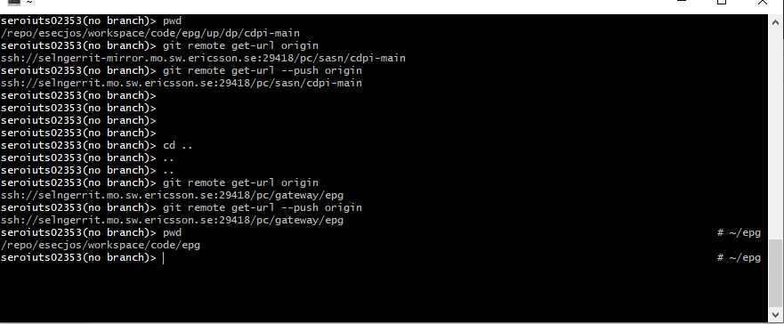

git submodule update --init --recursive --force

From <https://teams.microsoft.com/multi-window/?agent=electron&version=22020701810> 

cmake -DCMAKE_BUILD_TYPE=RelWithDebInfo -DINTEGRATION_MODE=OFF -DCMAKE_TOOLCHAIN_FILE=../../BuildAndTools/cmake/linux_x86_64.cmake -DUSE_MEMCHECK_VALGRIND=ON -DCMAKE_EXPORT_COMPILE_COMMANDS=ON -DUSE_EPG_3PP=ON -GNinja ..

From <https://teams.microsoft.com/multi-window/?agent=electron&version=22020701810> 

git mergetool --tool=kdiff3

From <https://teams.microsoft.com/multi-window/?agent=electron&version=22020701810> 

[21/12/2021 12:53] Javier Ulibarri Lopez

gpush = "!f() { git push origin HEAD:refs/for/${1}; }; f"

git remote set-url --push origin ssh://selngerrit.mo.sw.ericsson.se:29418/pc/sasn/cdpi-main

From <https://teams.microsoft.com/multi-window/?agent=electron&version=22020701810> 

jenkins_job build_all -D -t

From <https://teams.microsoft.com/multi-window/?agent=electron&version=22020701810> 

